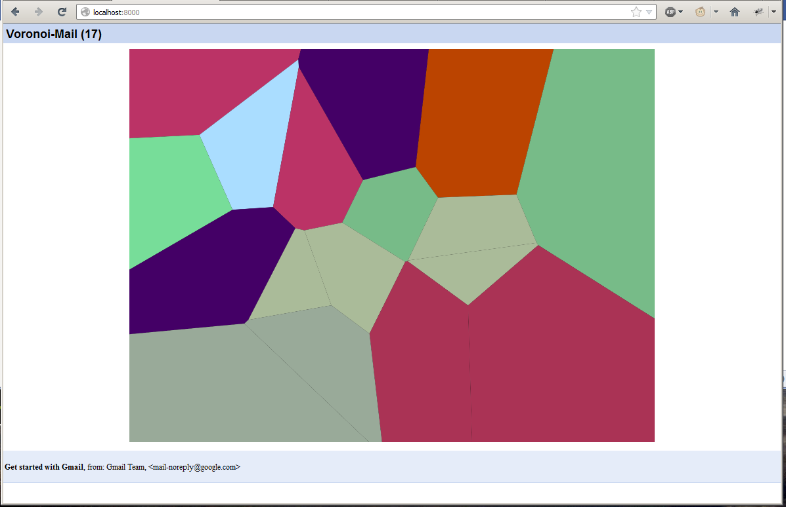

Voronoi-Mail
===========

Screenshot




Installation
--

 1. pip install [any dependency]
  
    specifically: 

    ````
    pip install xmltodict
    pip install keyring
    ````


Running
--

 1. Set a keyring password with `keyring` with perhaps the following script:

````
#!/usr/bin/env python
# coding=UTF-8

import getpass
import keyring

group1 = raw_input("Group 1: ")
group2 = raw_input("Group 2: ")
passwd1 = getpass.getpass("Password: ")
passwd2 = getpass.getpass("Password (again): ")

if passwd1 != passwd2:
    print("Error, your passwords don't match.")
    exit(1)
else:
    keyring.set_password(group1, group2, passwd1)
````


 1. Edit `/cgi-bin/check_email.py` to be your email address.

 1. Open up the folder, write "python -m CGIHTTPServer 8000", which will start the webserver on port 8000.
  
 1. Browse to http://localhost:8000/
 

Trivia
--

 * The POST request to pass the credentials from the page to itself isn't over SSL. This may or may not
	be an issue (note that the server is only running via localhost; don't run this publically!)
 
 * If you append "?unique", the emails with the same email accounts will be (probably) coloured uniquely,
	otherwise they will be coloured the same (though other emails may clash in the colouring.)
  
 * The Gmail API appears to only want to ever return 20 new emails.
 
 * Gmail has changed something recently so you need to approve this method of logging in and checking emails. You'll be emailed about it when you try.

FAQs
--

 * What does it do?
  
  It displays your unread emails as a Voronoi diagram; you may click on segments of the diagram to open
  particular emails. Upon receiving a new email, the diagram will be re-drawn.
  
